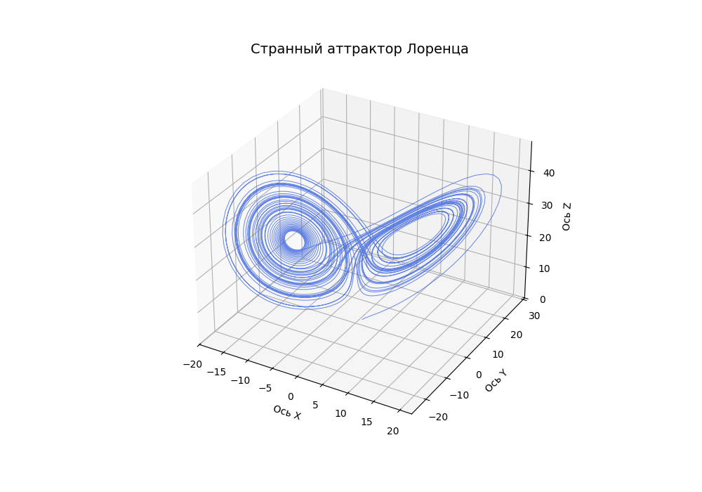

# Python Toolkit for Numerical Integration of ODEs

Python library for numerical integration of Ordinary Differential Equations (ODEs) using explicit methods.

This repository implements the classical **Euler Method**, **Runge-Kutta 2nd Order (Heun's Method)**, and **Runge-Kutta 4th Order (RK4)**. Fully vectorized via NumPy, the integrators natively support systems of arbitrary dimensions (from 1D growth models to multi-dimensional N-body simulations).

## Features

- **Arbitrary Dimensionality**: Works out-of-the-box with any state vector shape.
- **Preallocated trajectory storage using NumPy arrays.**: Allocates a continuous block of memory upfront (`np.empty`), eliminating dynamic list resizing overhead.
- **Strict Typing**: Fully type-hinted using modern `numpy.typing` and `collections.abc` for static analysis compliance (`mypy`).
- **Zero Heavy Dependencies**: Requires only `numpy`.

---

## Mathematical Background

The library solves autonomous initial value problems (IVPs) of the form:

$$\frac{d\mathbf{y}}{dt} = f(\mathbf{y}, \dots)$$

where $\mathbf{y}$ is the state vector and $f$ is the system derivative function.

### 1. Explicit Euler Method

The simplest first-order truncation error $\mathcal{O}(h)$ method. It advances the state along the tangent lines:

$$\mathbf{y}_{n+1} = \mathbf{y}_n + h \cdot f(\mathbf{y}_n)$$

### 2. Runge-Kutta 2nd Order (Heun's Method)

A second-order method $\mathcal{O}(h^2)$ that improves upon Euler by averaging the derivative at the beginning and the predicted end of the interval:

$$\mathbf{k}_1 = f(\mathbf{y}_n)$$

$$\mathbf{k}_2 = f(\mathbf{y}_n + h \cdot \mathbf{k}_1)$$

$$\mathbf{y}_{n+1} = \mathbf{y}_n + \frac{h}{2} (\mathbf{k}_1 + \mathbf{k}_2)$$

### 3. Classical Runge-Kutta 4th Order (RK4)

The industry standard explicit solver with a fourth-order local truncation error $\mathcal{O}(h^4)$. It samples the derivative four times across the interval:

$$\mathbf{k}_1 = f(\mathbf{y}_n)$$

$$\mathbf{k}_2 = f\left(\mathbf{y}_n + \frac{h}{2}\mathbf{k}_1\right)$$

$$\mathbf{k}_3 = f\left(\mathbf{y}_n + \frac{h}{2}\mathbf{k}_2\right)$$

$$\mathbf{k}_4 = f(\mathbf{y}_n + h\mathbf{k}_3)$$

$$\mathbf{y}_{n+1} = \mathbf{y}_n + \frac{h}{6} \left( \mathbf{k}_1 + 2\mathbf{k}_2 + 2\mathbf{k}_3 + \mathbf{k}_4 \right)$$

---

## Usage Example: Lorenz Attractor (3D System)

Here is a quick demonstration of integrating a chaotic 3D system using the provided **RK4** integrator from the package structure.

```python
import numpy as np
import numtoolkit as nt

# 1. Define the system equations (using packaged lorenz or custom function)
def lorenz_system(point, sigma=10.0, rho=28.0, beta=8.0/3.0):
    x, y_coord, z = point, point, point
    dx = sigma * (y_coord - x)
    dy = x * (rho - z) - y_coord
    dz = x * y_coord - beta * z
    return np.array([dx, dy, dz], dtype=np.float64)

# 2. Setup initial conditions
initial_state = [1.0, 1.0, 1.0] # [x0, y0, z0]
dt = 0.01
steps = 1000

# 3. Run universal solver passing the specific step method
trajectory = nt.integrate(
    f=lorenz_system,
    y0=initial_state,
    h=dt,
    steps=steps,
    method_step=nt.rk4_step
)

print(f"Final state: {trajectory[-1]}")
```

## Lorenz Attractor



## Repository Structure

```text
numerical-methods-toolkit/
├── numtoolkit/
│   ├── __init__.py
│   ├── core/
│   │   ├── integrator.py
│   │   └── types.py
│   ├── methods/
│   │   ├── euler.py
│   │   ├── rk2.py
│   │   └── rk4.py
│   └── systems/
│       └── lorenz.py
├── examples/
│   └── lorenz_example.py
├── tests/
│   └── test_rk4.py
└── requirements.txt
```

## License

This project is open-source and available under the [MIT License](LICENSE).
